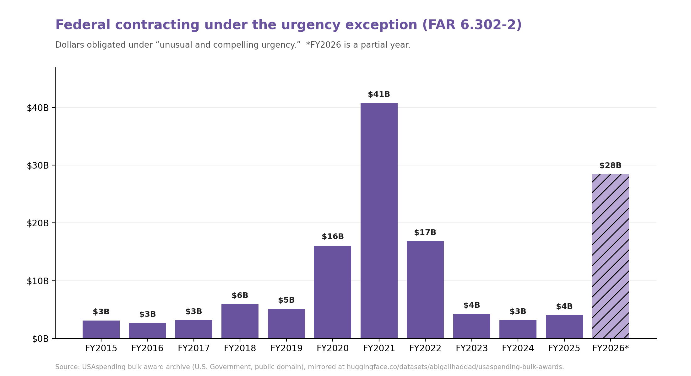
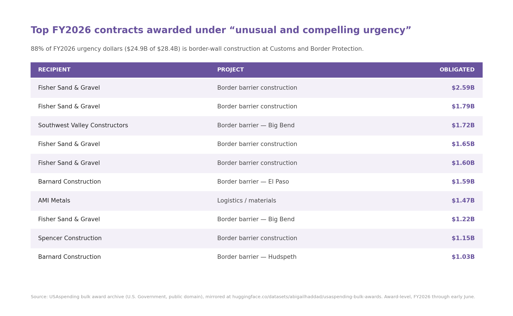

# urgency-tracker

When the government wants to skip competition on a contract, one of the reasons it's allowed to give is "unusual and compelling urgency" — FAR 6.302-2, where the standard is basically that the government would be seriously injured, financially or otherwise, if it had to take the time to compete the work. I wanted to see how often that actually gets used, and where the money goes.

It all runs off my HuggingFace mirror of USAspending — you query it with DuckDB straight over `hf://`, **no download, no API key, no rate limit**. `demo.ipynb` is the whole thing, and it opens in Colab.

## What I found



There's a COVID-era spike (FY2021 ~$41B), then a few quiet years (~$3–5B). And then FY2026, which isn't even a full year yet, is already at ~$28B — and **88% of that ($24.9B) is border-wall construction at Customs and Border Protection.** A handful of contractors hold most of it:



## The granular data

`urgency_contracts.py` pulls every urgency contract for a year into a CSV — recipient, agency, dollars, dates, NAICS/PSC, description:

```bash
python urgency_contracts.py --year 2026
```

The repo ships `urgency_contracts_fy2026.csv` (2,755 awards) so you can just open it without running anything.

## Running the notebook

```bash
pip install -r requirements.txt
jupyter notebook demo.ipynb        # also opens in Colab — no key needed
```

## Why the mirror, and not the USAspending API

USAspending's search API has **no working filter for the urgency reason** — I checked: it accepts the filter and silently ignores it (you get all ~2.9M contracts back either way). To pull the urgency subset through the API you'd have to page through awards and make a per-award detail call on each one to read the competition field, and the trend (aggregate dollars per year) isn't really doable at all. On the mirror it's one line —

```sql
WHERE other_than_full_and_open_competition ILIKE '%URGENCY%'
```

— filtering *and* aggregating twenty years at once.

## Caveats (worth reading before you quote a number)

- These are contract *actions* (every modification is a row); dollars are obligations summed, which can include de-obligations. I group by `award_id_piid` for award-level.
- FY2026 is partial — through the latest archive snapshot — so action counts are low even where dollars are high.
- "Urgency" = the `other_than_full_and_open_competition` field saying `URGENCY (FAR 6.302-2)`. That's the agency's own coding, and USAspending records the reason *code*, not the written justification.
- Competition coding is mandatory FPDS reporting, so this is the complete universe, not a sample.

## Sources

USAspending bulk award data (public domain, U.S. Government), mirrored at [`abigailhaddad/usaspending-bulk-awards`](https://huggingface.co/datasets/abigailhaddad/usaspending-bulk-awards). Code's CC0 — do whatever you want with it.
