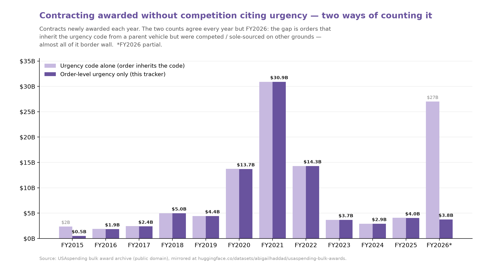

# urgency-tracker

When the government wants to skip competition on a contract, one of the reasons it's allowed to give is "unusual and compelling urgency" — FAR 6.302-2, where the standard is basically that the government would be seriously injured, financially or otherwise, if it had to take the time to compete the work. I wanted to see how often that actually gets used, and where the money goes.

**Live site: [urgency-tracker.vercel.app](https://urgency-tracker.vercel.app)** — a searchable, filterable table of every urgency award (click a row for detail), with GAO bid-protest status pulled from makegov. It rebuilds when the data updates (see `site/` and `scripts/build_feed.py`).

It all runs off my HuggingFace mirror of USAspending — you query it with DuckDB straight over `hf://`, **no download, no API key, no rate limit**. `demo.ipynb` is the whole thing, and it opens in Colab.

## What I found

There are two defensible ways to count this, and the chart shows both.



**Why two bars.** The obvious filter is the FPDS competition code `other_than_full_and_open_competition = URGENCY (FAR 6.302-2)` (the light bars). But that code has a wrinkle: a task or delivery order *inherits* it from the parent contract vehicle it's placed against. So an order can carry the urgency code while its own competition basis — the *order-level* field `fair_opportunity_limited_sources` (FAR 16.505) — says the order was actually **competed** among the vehicle's awardees ("fair opportunity given") or sole-sourced on a **different** ground ("only one source"). The dark bars keep an award only when its order-level basis is genuinely urgency, or it's a standalone contract where the Part-6 urgency code *is* the basis.

For eleven of the twelve years the two counts are the same — most urgency awards are standalone sole-source contracts, so there's no parent code to inherit. They diverge in one place: **FY2026, ~$27B on the code alone vs. ~$3.8B order-level**. The gap is almost entirely border-wall delivery orders placed off larger vehicles, which carry the inherited urgency code but weren't sole-sourced *for* urgency at the order level. The live site and `urgency_contracts.py` use the order-level count (the dark bars); if you want the raw-code number instead, drop the `fair_opportunity_limited_sources` filter.

## The granular data

`urgency_contracts.py` pulls every urgency contract for a year into a CSV — recipient, agency, dollars, dates, NAICS/PSC, description, and a **direct USAspending link** (`usaspending_url`) to each award's page, so you can click straight through to verify it:

```bash
python urgency_contracts.py --year 2026
```

On each award page, the urgency designation is under **Additional Details → Competition Details**, where *"Other than Full and Open Competition"* reads **"Urgency."** (That's the reason *code*, not the written justification — the page tells you it was urgency, not why.)

The repo ships `urgency_contracts_fy2026.csv` (2,755 awards) so you can just open it without running anything.

## Running the notebook

```bash
pip install -r requirements.txt
jupyter notebook demo.ipynb        # also opens in Colab — no key needed
```

## Why the mirror, and not the USAspending API

USAspending's search API has **no working filter for the urgency reason** — I checked: it accepts the filter and silently ignores it (you get all 2.9M-odd contracts back either way). To pull the urgency subset through the API you'd have to page through awards and make a per-award detail call on each one to read the competition field, and the trend (aggregate dollars per year) isn't really doable at all. On the mirror it's one line —

```sql
WHERE other_than_full_and_open_competition ILIKE '%URGENCY%'
```

— filtering *and* aggregating twenty years at once.

## Caveats (worth reading before you quote a number)

- These are contract *actions* (every modification is a row); dollars are obligations summed, which can include de-obligations. I group by `award_id_piid` for award-level.
- FY2026 is partial — through the latest archive snapshot — so action counts are low even where dollars are high.
- "Urgency" = the `other_than_full_and_open_competition` field saying `URGENCY (FAR 6.302-2)`. That's the agency's own coding, and USAspending records the reason *code*, not the written justification.
- Competition coding is mandatory FPDS reporting, so this is the complete universe, not a sample.

## Sources

USAspending bulk award data (public domain, U.S. Government), mirrored at [`abigailhaddad/usaspending-bulk-awards`](https://huggingface.co/datasets/abigailhaddad/usaspending-bulk-awards). Code's CC0 — do whatever you want with it.
